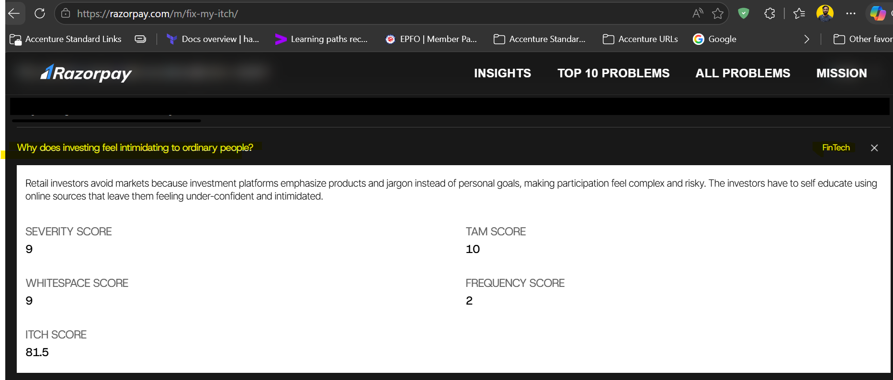

# TrueNorth (India Edition): Product Concept & Execution Plan
*A Goal-First Micro-Investing Platform for the Everyday Indian Investor*

Idea is form : Razorpay

https://razorpay.com/m/fix-my-itch/

---

## 1. Executive Summary & Market Opportunity
While the Indian mutual fund industry has seen tremendous growth, millions of retail investors still keep their money parked in traditional Fixed Deposits (FDs). They avoid the capital markets because platforms emphasize financial jargon (e.g., ELSS, AMC, Expense Ratios, Nifty50) instead of personal goals. 

**The Strategy:** TrueNorth wins the Indian market by replacing the intimidation of trading terminals with a simplified, intuitive **translation engine**. Furthermore, recognizing the growing aspiration among Indian investors to own a piece of global brands (like Apple or Google), the platform bundles domestic simplicity with a window to global markets. 

---

## 2. The Product Vision: TrueNorth (Web & Mobile)
TrueNorth completely hides traditional financial jargon behind plain-English life goals, SIP (Systematic Investment Plan) simulations, and localized Indian use cases.

### Core Features
*   **The Goal Translator:** Users create "Buckets" (e.g., *Buying a Flat in Mumbai*, *Emergency Corpus*, *Child's Education*). The system automatically maps these time horizons to appropriate Indian mutual funds or index funds.
*   **The Sandbox Simulator:** Before doing standard KYC (Know Your Customer) processes, users can play with historical data. They can visualize scenarios like, *"What if I had set up an SIP of ₹5,000/month over the last 3 years?"* to build confidence before risking real capital.
*   **Jargon Auto-Translate:** A universal toggle that translates Indian financial terminology into everyday analogies.
    *   *Example:* Toggling "ELSS Fund" changes the text to "A tax-saving basket of stocks with a mandatory 3-year lock-in."
*   **"TrueNorth Passport" (Global Window):** A dedicated feature allowing users to view details of international markets. Users can track top US stocks and global ETFs, demystifying international diversification and eventually allowing fractional investments in global tech giants directly with Indian Rupees (INR).
*   **Action-Triggered Learning:** Bite-sized, 30-second lessons (e.g., explaining why markets dip) appear contextually *only* when a user is making a related decision.

---

## 3. Step-by-Step Execution Roadmap

Building TrueNorth in India requires navigating the unique regulatory landscape (SEBI) and utilizing the rich ecosystem of domestic financial APIs.

### Phase 1: UX Validation & Prototype (Months 1-2)
*   **Goal:** Validate the emotional shift from overwhelmed to relieved.
*   **Action:** Build a high-fidelity Figma prototype of the "Goal Creation" flow and the "Jargon Translator."
*   **Testing:** Put this in front of 50 non-investors in tier-1 and tier-2 Indian cities to measure qualitative feedback. Do not write backend code yet.

### Phase 2: The Sandbox MVP (Months 3-4)
*   **Goal:** Lead generation and intent capture.
*   **Action:** Build the frontend simulator without asking for PAN cards or bank linking. For historical Mutual Fund data to power the simulator, you can integrate with free services like MFapi.in which provides historical NAV data for Indian mutual funds. 
*   **Outcome:** Lowers the barrier to entry to zero, letting users experience the magic of compounding immediately.

### Phase 3: Domestic Market & Payment Integration (Months 5-7)
*   **Goal:** Enable real-money transactions in INR.
*   **Action:** Partner with wealth-tech integration platforms like Mindstack to handle the heavy lifting of the Indian financial plumbing. 
*   **Integrations Needed:**
    *   **Exchanges & RTAs:** Integration with NSE / BSE and RTAs like CAMS / KFintech for automated transaction reports and data sync.
    *   **KYC:** Implement CKYC, Digilocker, Aadhaar masking, and PAN validation to ensure strict SEBI compliance.
    *   **Payments:** Integrate Razorpay, PayU, and UPI for seamless and instant investment experiences.

### Phase 4: TrueNorth Passport / Global Integration (Months 8-9)
*   **Goal:** Roll out the international market feature.
*   **Action:** Integrate with a cross-border Brokerage-as-a-Service (BaaS) provider (like DriveWealth or Alpaca). Initially, this will be an informational "view-only" window to track US stocks. 
*   **Refinement:** Gradually open up fractional US investing (under the RBI's Liberalised Remittance Scheme - LRS guidelines), allowing users to allocate 10% of their portfolio to global tech.

### Phase 5: Go-to-Market & Trust Loops (Months 10+)
*   **Goal:** Scale user acquisition and refine onboarding.
*   **Action:** Launch publicly with a marketing strategy focused on debunking finance myths for the Indian middle class. 
*   **Channels:** Leverage YouTube Shorts and Instagram Reels featuring 15-second explanations of basic concepts (e.g., *FD vs. Debt Funds*), funneling users straight to the TrueNorth Sandbox.
