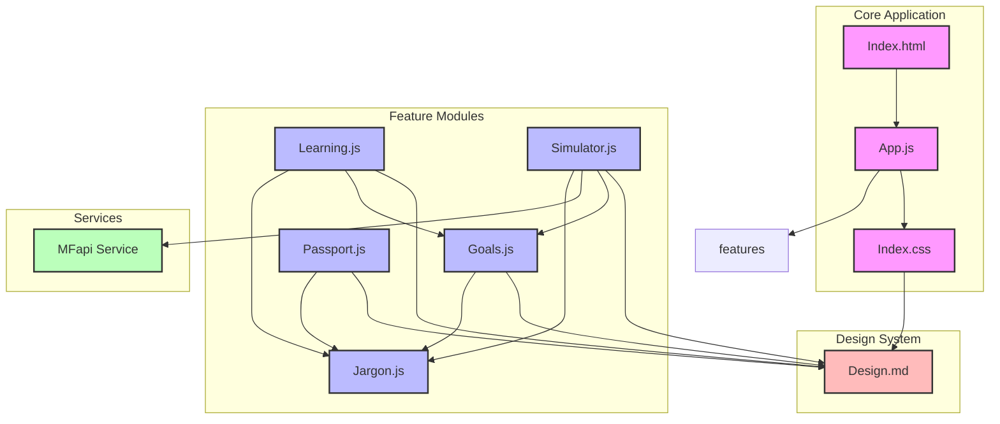

# TrueNorth

TrueNorth is a financial education and simulation platform designed to help users understand compounding, inflation, and investment strategies. It features interactive learning modules, a financial simulator, goal tracking, and global asset exploration.

## Features

- **Financial Simulator**: Visualize compounding interest, historical CAGRs, and investment growth over time through interactive charts.
- **Goal Tracking**: Set, manage, and calculate required Systematic Investment Plans (SIPs) to reach your financial milestones.
- **Learning Modules**: Interactive lessons on market history, compounding, and inflation with built-in widgets.
- **Global Passport**: Explore global assets and understand international market dynamics.
- **Jargon Buster**: Demystifies complex financial terminology with a built-in dictionary and DOM translation.

## Project Structure

- `index.html` / `index.css` - Main structure and styling
- `js/app.js` - Core application logic, routing, and navigation
- `js/goals.js` - Goal management and SIP calculations
- `js/learning.js` - Interactive lessons and market history
- `js/passport.js` - Global assets and currency formatting
- `js/simulator.js` - Investment simulation and charting
- `js/jargon.js` - Financial dictionary and translation
- `design/DESIGN.md` - UI/UX reference guidelines (inspired by Stripe)

## Architecture Insights

Based on the [Graphify knowledge graph](./graphify-out/), the system uses a modular vanilla JavaScript architecture:
- **Routing**: Handled via `switchTab()` in `app.js`, which orchestrates rendering across tabs (`renderGoals`, `updateSimulator`, `renderLearningTab`).
- **Core Abstractions**: Utility functions like `formatINR()`, `formatUSD()`, and `t()` (for translation) act as god nodes bridging the different feature communities.
- **State**: Each module manages its domain (e.g., `goals`, `lessons`, `marketHistory`, `globalAssets`).

## Getting Started

1. Clone this repository.
2. Open `index.html` in a web browser.
3. For development, serve the files using a local HTTP server (e.g., `npx serve .` or Python's `http.server`).

## Mermaid Diagram Explanation

The architecture diagram above shows:

1. **Core Application**: The entry point (index.html), main application logic (app.js), and styling (index.css)
2. **Feature Modules**: Individual components handling specific functionality:
   - Goals: Investment goal management and SIP calculations
   - Learning: Interactive financial education modules
   - Passport: Global markets and currency handling
   - Simulator: Investment simulation with historical data
   - Jargon: Financial terminology translation system
3. **Services**: External service integrations (MFapi for mutual fund data)
4. **Design System**: Stripi-inspired UI/UX guidelines

Key architectural patterns:
- Modular ES6 architecture with clear separation of concerns
- Shared utilities (jargon translation, currency formatting) used across modules
- Event-driven communication between modules
- Centralized state management within each module
- Design system tokens applied consistently across all components