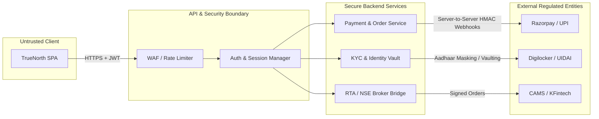

# TrueNorth Security Audit & Vulnerability Assessment Report

**Target**: TrueNorth (India Edition)  
**Date**: September 18, 2026  
**Auditor**: Antigravity Security Audit Engine  
**Assessment Type**: Defensive Source-First Codebase Audit  
**Artifact Path**: `security/scan.md`  

---

## 1. Executive Summary

A comprehensive source-level security audit of the **TrueNorth (India Edition)** codebase was conducted. TrueNorth is an early-stage, goal-first financial education and simulation platform built with modern modular JavaScript (ES6), HTML5, and CSS3. 

The audit evaluated application architecture, trust boundaries, user input handling, rendering logic, external service simulation, browser-side state management, and configuration hygiene.

### Overall Security Posture: Moderate Risk (Pre-Production Sandbox)
While the application currently operates entirely in the browser client without server-side persistence or active payment gateways, multiple vulnerabilities—most notably **DOM-based Cross-Site Scripting (XSS)** and the **absence of Content Security Policy (CSP)**—exist. Left unmitigated, these vulnerabilities will pose critical risks as TrueNorth transitions into Phase 3 (Payments, KYC, PAN/Aadhaar handling, and mutual fund execution).

### Vulnerability Summary

| Finding ID | Title | Severity | OWASP Top 10 | Status |
| :--- | :--- | :--- | :--- | :--- |
| **TN-SEC-01** | DOM-based Cross-Site Scripting (XSS) via Unsanitized Goal Title | **High** | A03:2021-Injection | **Confirmed** |
| **TN-SEC-02** | Absence of Content Security Policy (CSP) & Frame Controls | **Medium** | A05:2021-Security Misconfiguration | **Confirmed** |
| **TN-SEC-03** | Insecure HTML String Interpolation in Jargon Translation Engine | **Medium** | A03:2021-Injection | **Confirmed** |
| **TN-SEC-04** | Client-Side Mathematical Boundary Violations (Division by Zero / NaN) | **Low** | A04:2021-Insecure Design | **Confirmed** |
| **TN-SEC-05** | Fragile Date Parsing and Error Handling in NAV Series Generation | **Low** | A04:2021-Insecure Design | **Confirmed** |
| **TN-SEC-06** | Missing Subresource Integrity (SRI) for Third-Party Assets | **Informational** | A08:2021-Software & Data Integrity Failures | **Confirmed** |
| **TN-SEC-07** | Dependabot Manifest Misconfiguration (Missing `package.json`) | **Informational** | A05:2021-Security Misconfiguration | **Confirmed** |

---

## 2. Architecture & Threat Model

### 2.1 Component Breakdown & Data Flow

```mermaid
flowchart TD
    User([User Browser])
    
    subgraph ClientApp["TrueNorth Client (Browser DOM)"]
        IndexHTML["index.html"]
        App["app.js (Router / Coordinator)"]
        Goals["goals.js (Goal Wizard & State)"]
        Sim["simulator.js (SVG Chart & Math)"]
        Passport["passport.js (Global Assets)"]
        Learning["learning.js (Interactive Hub)"]
        Jargon["jargon.js (DOM Translator)"]
        MFapi["services/mfapi.js (Mock Service)"]
    end

    subgraph ExternalServices["External Endpoints (Present & Planned)"]
        GFONTS["Google Fonts (fonts.googleapis.com)"]
        MOCK_API["MFapi.in (Planned Live Endpoint)"]
        PAYMENTS["Razorpay / UPI (Planned Phase 3)"]
        KYC["Digilocker / CKYC (Planned Phase 3)"]
    end

    User -->|Input: Goal Name, Sliders, Toggles| IndexHTML
    IndexHTML --> App
    App --> Goals
    App --> Sim
    App --> Passport
    App --> Learning
    Goals -->|t() markup| Jargon
    Sim -->|t() markup| Jargon
    Sim --> MFapi
    Passport -->|t() markup| Jargon
    IndexHTML -.->|Load Stylesheet & Fonts| GFONTS
    MFapi -.->|Future HTTP requests| MOCK_API
```

### 2.2 Trust Boundaries

1. **User Input vs. DOM Sink Boundary**: User input from input fields (`<input type="text" id="goal-name-input">`) crosses directly into `Element.innerHTML` sinks without encoding or sanitization.
2. **Third-Party API vs. Client Display Boundary**: Data returned from external API endpoints (`MFapi.in` or similar) is treated as trusted strings when generating UI explanations.
3. **Client vs. Future Execution Boundary**: In Phase 3, client-calculated SIP values, user identities, and investment amounts must never be trusted by downstream backend/payment services.

---

## 3. Confirmed Findings & Detailed Analysis

---

### [TN-SEC-01] DOM-based Cross-Site Scripting (XSS) via Unsanitized Goal Title

- **Severity**: **High**
- **CVSS v3.1**: 7.4 (`CVSS:3.1/AV:N/AC:L/PR:N/UI:R/S:C/C:L/I:L/A:N`)
- **Affected Files**:
  - [goals.js](file:///c:/Users/avinash.cm.kumar/personal/TrueNorth/js/goals.js#L131-L145) (Lines 131–145, 275, 331)
- **CWE**: CWE-79 (Improper Neutralization of Input During Web Page Generation)

#### Vulnerability Mechanism
In [goals.js](file:///c:/Users/avinash.cm.kumar/personal/TrueNorth/js/goals.js), user input from the goal creation wizard is bound to the `goalName` state variable without sanitization:

```javascript
// js/goals.js: line 375-379
const nameInput = document.getElementById('goal-name-input');
if (nameInput) {
  nameInput.addEventListener('input', (e) => {
    goalName = e.target.value;
  });
}
```

This variable is directly concatenated into HTML strings assigned to `Element.innerHTML` in two places:

1. **In the Wizard Preview (Step 3)**:
   ```javascript
   // js/goals.js: line 331
   <div class="preview-row">
     <span class="preview-label">Target Goal</span>
     <span class="preview-value">${goalName || 'My Goal'} (${formatINR(targetAmount)})</span>
   </div>
   ```
2. **In the Active Goals Dashboard (`renderGoals`)**:
   ```javascript
   // js/goals.js: line 143
   <div>
     <h3 class="goal-title">${goal.title}</h3>
     <div class="goal-target">Target: ${formatINR(goal.targetAmount)}</div>
   </div>
   ```
3. **In the Input Value Attribute (Step 2)**:
   ```javascript
   // js/goals.js: line 275
   <input type="text" id="goal-name-input" class="input-text" value="${goalName}" placeholder="e.g. My Mumbai Flat">
   ```
   If `goalName` contains quotes (e.g. `" onfocus="alert(1)" autofocus="`), it breaks out of the `value` attribute into an inline event handler.

#### Concrete Attack Scenario
1. An attacker constructs a payload or tricks a user into entering a crafted goal title (or imports goals via future URL params / shared state):
   ```html
   
   ```
2. The user advances from Step 2 to Step 3 in the goal wizard.
3. `renderWizard()` sets `container.innerHTML = ...`, immediately executing the JavaScript payload within the application's origin context.
4. When the goal is saved and rendered on the dashboard, `renderGoals()` executes the payload again every time the user visits the dashboard.

#### Impact
Execution of arbitrary JavaScript in the victim's session. In future iterations where authentication cookies, JWT tokens, CKYC records, or payment sessions exist, an attacker could extract credentials, tamper with simulated numbers, or redirect users to phishing flows.

#### Remediation
Implement an HTML entity encoder and use safe text node assignments or sanitize all dynamic variables prior to `innerHTML` interpolation.

```javascript
// Utility function: escapeHTML
export function escapeHTML(str) {
  if (!str) return '';
  return String(str)
    .replace(/&/g, '&amp;')
    .replace(/</g, '&lt;')
    .replace(/>/g, '&gt;')
    .replace(/"/g, '&quot;')
    .replace(/'/g, '&#39;');
}
```

Apply `escapeHTML(goal.title)` and `escapeHTML(goalName)` in [goals.js](file:///c:/Users/avinash.cm.kumar/personal/TrueNorth/js/goals.js).

---

### [TN-SEC-02] Absence of Content Security Policy (CSP) & Frame Controls

- **Severity**: **Medium**
- **CVSS v3.1**: 5.4 (`CVSS:3.1/AV:N/AC:L/PR:N/UI:R/S:U/C:L/I:L/A:N`)
- **Affected Files**:
  - [index.html](file:///c:/Users/avinash.cm.kumar/personal/TrueNorth/index.html#L1-L14)
- **CWE**: CWE-1021 (Improper Restriction of Rendered UI Layers / Clickjacking), CWE-358

#### Vulnerability Mechanism
[index.html](file:///c:/Users/avinash.cm.kumar/personal/TrueNorth/index.html) does not define any `Content-Security-Policy` meta tag or HTTP response headers:
- There is no restriction on which domains can frame the application (`frame-ancestors`), leaving it vulnerable to clickjacking or UI redressing attacks.
- There is no restriction on script execution sources (`script-src`), allowing inline injection scripts (such as TN-SEC-01) to execute freely.
- There are no restrictions on outbound network connections (`connect-src`), allowing injected scripts to exfiltrate DOM data to arbitrary attacker-controlled servers.

#### Concrete Attack Scenario
1. An attacker frames TrueNorth inside a transparent `<iframe>` on a malicious site (`fintech-offers-free.com`).
2. When the user interacts with goal creation or financial buttons, clicks are intercepted or redressed to trick the user into unintended actions.
3. Furthermore, any exploited XSS payload can freely transmit user simulation data, session tokens, or personal identifiers to an external receiver without browser restriction.

#### Remediation
Add a strict Content Security Policy meta tag in [index.html](file:///c:/Users/avinash.cm.kumar/personal/TrueNorth/index.html), and configure corresponding HTTP headers (`X-Frame-Options: DENY`, `X-Content-Type-Options: nosniff`, `Content-Security-Policy`) on the production hosting server:

```html
<meta http-equiv="Content-Security-Policy" content="
  default-src 'self';
  script-src 'self';
  style-src 'self' 'unsafe-inline' https://fonts.googleapis.com;
  font-src 'self' https://fonts.gstatic.com;
  img-src 'self' data:;
  connect-src 'self' https://api.mfapi.in;
  frame-ancestors 'none';
  base-uri 'self';
  form-action 'self';
">
```

---

### [TN-SEC-03] Insecure HTML Attribute & String Interpolation in Jargon Translation Engine

- **Severity**: **Medium**
- **CVSS v3.1**: 5.3 (`CVSS:3.1/AV:N/AC:L/PR:N/UI:N/S:U/C:N/I:L/A:N`)
- **Affected Files**:
  - [jargon.js](file:///c:/Users/avinash.cm.kumar/personal/TrueNorth/js/jargon.js#L78-L93) (Lines 78–93)
  - [simulator.js](file:///c:/Users/avinash.cm.kumar/personal/TrueNorth/js/simulator.js#L418-L422) (Lines 418–422)
- **CWE**: CWE-116 (Improper Encoding or Escaping of Output)

#### Vulnerability Mechanism
In [jargon.js](file:///c:/Users/avinash.cm.kumar/personal/TrueNorth/js/jargon.js), function `t(key, overrideText)` generates HTML markup:

```javascript
// js/jargon.js: line 78-93
export function t(key, overrideText) {
  const item = jargonDictionary[key];
  if (!item) return overrideText || key;
  
  const text = isSimplified ? item.simplified : (overrideText || item.jargon);
  const tooltipText = isSimplified 
    ? `Original term: "${item.jargon}". ${item.explanation}` 
    : item.explanation;
  
  const className = isSimplified ? "jargon-term jargon-translated" : "jargon-term";

  return `<span class="${className}" data-jargon-key="${key}" data-override="${overrideText || ''}">
    <span class="jargon-text-node">${text}</span>
    <span class="jargon-tooltip">${tooltipText}</span>
  </span>`;
}
```

Notice:
1. `overrideText` is directly inserted into attribute `data-override="${overrideText || ''}"` without escaping double quotes. If `overrideText` contains quotes or attributes, it breaks HTML attributes.
2. If `key` is not in `jargonDictionary`, `t()` returns `overrideText || key` raw.
3. In [simulator.js](file:///c:/Users/avinash.cm.kumar/personal/TrueNorth/js/simulator.js#L418-L422):
   ```javascript
   const schemeName = await getSchemeName(selectedSchemeCode) || selectedSchemeCode;
   noteEl.innerHTML = `
       This simulation reflects actual historical NAV data of the <strong>${t(schemeName)}</strong>
       mutual fund over the last <strong>${historicalPeriod} years</strong>.
   `;
   ```
   When `selectedSchemeCode` comes from external API responses or URL parameters, injecting `schemeName` into `noteEl.innerHTML` without sanitization permits DOM injection.

#### Remediation
Sanitize `overrideText` and `text` values in `t()`, escaping quotes and special characters before inserting into attribute values or text nodes.

---

### [TN-SEC-04] Client-Side Mathematical Boundary Violations (Division by Zero / NaN)

- **Severity**: **Low**
- **CVSS v3.1**: 3.7 (`CVSS:3.1/AV:N/AC:H/PR:N/UI:N/S:U/C:N/I:L/A:L`)
- **Affected Files**:
  - [goals.js](file:///c:/Users/avinash.cm.kumar/personal/TrueNorth/js/goals.js#L80-L86) (Lines 80–86)
  - [simulator.js](file:///c:/Users/avinash.cm.kumar/personal/TrueNorth/js/simulator.js#L54-L66) (Lines 54–66)
- **CWE**: CWE-369 (Divide By Zero), CWE-128 (Wrap-Around Error)

#### Vulnerability Mechanism
In [goals.js](file:///c:/Users/avinash.cm.kumar/personal/TrueNorth/js/goals.js):
```javascript
function calculateRequiredSIP(target, years, rate) {
  const r = rate / 12;
  const n = years * 12;
  if (r === 0) return Math.round(target / n);
  const sip = (target * r) / (Math.pow(1 + r, n) - 1);
  return Math.round(sip);
}
```
If `years <= 0` or invalid parameters are provided (e.g. through external state modification, console manipulation, or imported data), `n <= 0`. If `n = 0`, `Math.pow(1 + r, 0) - 1 = 0`, causing division by zero and returning `Infinity` or `NaN`.

Similarly, in [simulator.js](file:///c:/Users/avinash.cm.kumar/personal/TrueNorth/js/simulator.js):
```javascript
fdValue = sipAmount * ((Math.pow(1 + monthlyRateFD, m) - 1) / monthlyRateFD) * (1 + monthlyRateFD);
```
If `monthlyRateFD` is 0 or negative, this generates `NaN` or unexpected floating point outcomes that break the SVG chart renderer (`d="M NaN,NaN..."`).

#### Remediation
Add defensive parameter guards:
```javascript
function calculateRequiredSIP(target, years, rate) {
  if (!target || target <= 0 || !years || years <= 0 || !rate || rate <= 0) {
    return 0;
  }
  const r = rate / 12;
  const n = years * 12;
  const denom = Math.pow(1 + r, n) - 1;
  if (denom <= 0) return 0;
  const sip = (target * r) / denom;
  return Number.isFinite(sip) ? Math.round(sip) : 0;
}
```

---

### [TN-SEC-05] Fragile Date Parsing and Error Handling in NAV Series Generation

- **Severity**: **Low**
- **CVSS v3.1**: 3.1 (`CVSS:3.1/AV:N/AC:H/PR:N/UI:N/S:U/C:N/I:N/A:L`)
- **Affected Files**:
  - [simulator.js](file:///c:/Users/avinash.cm.kumar/personal/TrueNorth/js/simulator.js#L92-L96) (Lines 92–96)
  - [mfapi.js](file:///c:/Users/avinash.cm.kumar/personal/TrueNorth/js/services/mfapi.js#L43-L44) (Lines 43–44)
- **CWE**: CWE-754 (Improper Check for Unusual or Exceptional Conditions)

#### Vulnerability Mechanism
In [simulator.js](file:///c:/Users/avinash.cm.kumar/personal/TrueNorth/js/simulator.js):
```javascript
const sortedData = [...navData].sort((a, b) => {
  const [dayA, monthA, yearA] = a.date.split('-').reverse().join('-').split('-').map(Number);
  const [dayB, monthB, yearB] = b.date.split('-').reverse().join('-').split('-').map(Number);
  return new Date(yearA, monthA-1, dayA) - new Date(yearB, monthB-1, dayB);
});
```
1. `split('-').reverse().join('-').split('-')` assumes an exact format and structure. If any date in `navData` is in `YYYY-MM-DD` or malformed (as returned by some upstream APIs), the reversed array causes `day` and `year` to swap, passing invalid year integers to `new Date()`.
2. In [mfapi.js](file:///c:/Users/avinash.cm.kumar/personal/TrueNorth/js/services/mfapi.js#L15):
   The JSDoc specifies `toDate - End date in DD-YYYY format` (missing month component), whereas implementation expects `DD-MM-YYYY`.
3. If date parsing fails, `new Date()` produces `Invalid Date` (`NaN`), silently failing the sort and causing the simulator chart to render corrupt graphs or crash with unhandled exceptions.

#### Remediation
Use a standardized ISO-8601 or strict regex date parser with fallback handling:
```javascript
function parseIndianDate(dateStr) {
  if (!dateStr || typeof dateStr !== 'string') return new Date();
  const parts = dateStr.split('-');
  if (parts.length === 3) {
    const [day, month, year] = parts.map(Number);
    if (!isNaN(day) && !isNaN(month) && !isNaN(year)) {
      return new Date(year, month - 1, day);
    }
  }
  const fallback = new Date(dateStr);
  return isNaN(fallback.getTime()) ? new Date() : fallback;
}
```

---

### [TN-SEC-06] Missing Subresource Integrity (SRI) for Third-Party Assets

- **Severity**: **Informational**
- **CVSS v3.1**: 2.6 (`CVSS:3.1/AV:N/AC:H/PR:N/UI:R/S:U/C:N/I:L/A:N`)
- **Affected Files**:
  - [index.html](file:///c:/Users/avinash.cm.kumar/personal/TrueNorth/index.html#L9-L11)
- **CWE**: CWE-353 (Missing Support for Integrity Check)

#### Vulnerability Mechanism
Google Fonts stylesheets are loaded from an external origin without local fallbacks or verification:
```html
<link rel="preconnect" href="https://fonts.googleapis.com">
<link rel="preconnect" href="https://fonts.gstatic.com" crossorigin>
<link href="https://fonts.googleapis.com/css2?family=Inter:wght@300;400;500;600&display=swap" rel="stylesheet">
```
While Google dynamically generates fonts CSS based on user-agent, reliance on remote CDNs without offline font fallbacks exposes users to availability degradation if network connections fail or DNS poisoning occurs.

#### Remediation
Consider bundling fonts locally (`/fonts/inter.woff2`) to ensure 100% offline self-containment, privacy protection (preventing Google from harvesting visitor IP addresses), and zero third-party dependencies.

---

### [TN-SEC-07] Dependabot Manifest Misconfiguration (Missing `package.json`)

- **Severity**: **Informational**
- **Affected Files**:
  - [dependabot.yml](file:///c:/Users/avinash.cm.kumar/personal/TrueNorth/.github/dependabot.yml#L8-L11)
- **CWE**: CWE-1059 (Incomplete Documentation / Configuration)

#### Vulnerability Mechanism
[.github/dependabot.yml](file:///c:/Users/avinash.cm.kumar/personal/TrueNorth/.github/dependabot.yml) specifies:
```yaml
- package-ecosystem: "npm"
  directory: "/"
  schedule:
    interval: "weekly"
```
The repository does not currently contain a `package.json` file in the root directory. Consequently, automated Dependabot security scanning fails silently or consumes unnecessary workflow cycles.

#### Remediation
Either:
1. Initialize `package.json` with devDependencies (e.g. ESLint, Prettier, test runner, HTML validator).
2. Or comment out/remove the `npm` ecosystem block in `dependabot.yml` until Node/npm manifests are introduced.

---

## 4. Phase 3 & Production Regulatory Hardening Roadmap

According to the TrueNorth Product Concept Plan ([truenorth_india_product_plan.md](file:///c:/Users/avinash.cm.kumar/personal/TrueNorth/PLAN/truenorth_india_product_plan.md)), TrueNorth will evolve to support real-money transactions, Indian exchange integrations (NSE/BSE, CAMS/KFintech), CKYC/Digilocker, and Razorpay/UPI payments.

The following architectural security requirements must be enforced prior to production launch:



### 4.1 Digital Personal Data Protection (DPDP) Act 2023 & Aadhaar Regulations
1. **Aadhaar Masking**: Under UIDAI guidelines and SEBI Master Circulars, storing raw 12-digit Aadhaar numbers is strictly illegal unless operating as an authorized Aadhaar Vault. Only the last 4 digits may be visible; client-side document uploads must be redacted before storage.
2. **PAN Data Security**: Permanent Account Numbers (PAN) must be encrypted at rest (AES-256) and in transit (TLS 1.3), with strict access controls and audit logs.
3. **Explicit Consent Logs**: DPDP Act 2023 mandates that user consent for financial profiling and goal simulations must be clear, granular, and backed by auditable consent receipts.

### 4.2 Payment Gateway (Razorpay / UPI) Security
1. **Zero Client Trust for Calculations**: SIP amounts, NAV units, and investment totals calculated in `simulator.js` or `goals.js` must **never** be accepted directly by the payment processor. The backend must recalculate all order amounts from authoritative RTA feeds.
2. **Webhook Signature Verification**: When integrating Razorpay or UPI webhooks, ensure cryptographic signature verification using constant-time string comparison (`crypto.timingSafeEqual`) to prevent forged payment confirmations.
3. **Idempotency Keys**: Enforce unique UUIDv4 idempotency keys on all transaction requests to prevent double-debits during poor mobile connectivity in India.

### 4.3 Third-Party API Hardening (MFapi.in & Broker Integrations)
1. **Reverse Proxy Architecture**: Do not allow frontend clients to call third-party financial data APIs directly. Route requests through an internal backend proxy with caching (Redis) to:
   - Prevent IP leakage of end users.
   - Enforce rate-limiting and protect against upstream downtime.
   - Sanitize and validate all external API responses before forwarding them to the client.

---

## 5. Remediation Action Plan & Verification

### Prioritized Remediation Tasks

- [ ] **Task 1 (Critical Path)**: Implement HTML escaping utility in `js/goals.js` and sanitize `goal.title`, `goalName`, and dynamic modal inputs.
- [ ] **Task 2 (Security Headers)**: Add CSP `<meta>` tag into `index.html` with explicit whitelists and clickjacking protection (`frame-ancestors 'none'`).
- [ ] **Task 3 (Jargon Sanitization)**: Update `t(key, overrideText)` in `js/jargon.js` to escape attribute values and handle unmapped terms securely.
- [ ] **Task 4 (Mathematical Guards)**: Add boundary conditions (`years > 0`, `denom > 0`, `isFinite`) in SIP calculation functions in `js/goals.js` and `js/simulator.js`.
- [ ] **Task 5 (Config Hygiene)**: Align `.github/dependabot.yml` with the repository structure.

---

*Report generated and validated for TrueNorth (India Edition).*
