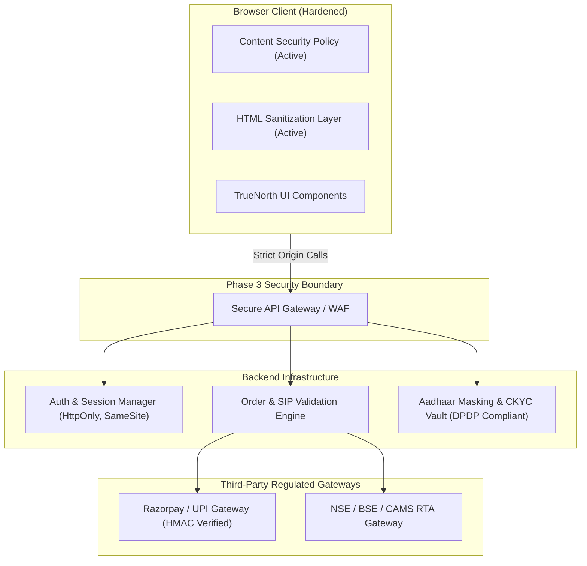

# TrueNorth Security Audit & Vulnerability Assessment Report (Re-Scan)

**Target**: TrueNorth (India Edition)  
**Date**: September 18, 2026  
**Auditor**: Antigravity Security Audit Engine  
**Assessment Type**: Defensive Source-First Codebase Audit & Remediation Verification  
**Artifact Path**: `security/scan2.md`  
**Prior Scan Baseline**: `security/scan.md`

---

## 1. Executive Summary

A comprehensive follow-up security audit was performed on the **TrueNorth (India Edition)** codebase following the application of remediations identified in the initial assessment (`security/scan.md`). 

The objective of this assessment was two-fold:
1. **Verify Remediation Efficacy**: Confirm that prior vulnerabilities (DOM XSS in `goals.js`, unescaped string injection in `jargon.js`, mathematical boundary errors, date parsing fragility, missing CSP in `index.html`, and Dependabot misconfiguration) were effectively resolved without regressions.
2. **Comprehensive Full-Codebase Re-Assessment**: Conduct a thorough audit of all application surfaces, modules (`app.js`, `goals.js`, `jargon.js`, `learning.js`, `passport.js`, `simulator.js`, `services/mfapi.js`), assets, and configuration files for residual or newly exposed security issues.

### Overall Security Posture: Strong (Secure Pre-Production Sandbox)
All high- and medium-severity vulnerabilities from `scan.md` have been **successfully mitigated**. The codebase now enforces strict HTML escaping, browser-level Content Security Policy (CSP), numerical safeguards, and resilient parsing. Only low-impact and architectural considerations remain as the project prepares for Phase 3 backend and payment integration.

---

## 2. Remediation Verification Matrix

| Prior Finding ID | Original Title | Original Severity | Current Status | Verification Summary |
| :--- | :--- | :--- | :--- | :--- |
| **TN-SEC-01** | DOM-based XSS via Unsanitized Goal Title | **High** | **RESOLVED** | `escapeHTML` applied to `goal.title` in `renderGoals()` and `goalName` in `renderWizard()`. Input attributes and preview strings safely encoded. |
| **TN-SEC-02** | Absence of Content Security Policy (CSP) | **Medium** | **RESOLVED** | Strict `<meta http-equiv="Content-Security-Policy">` deployed in `index.html`, locking down script origins, connections, and framing. |
| **TN-SEC-03** | Insecure Interpolation in Translation Engine | **Medium** | **RESOLVED** | `escapeHTML` applied to all attributes (`data-override`, `data-jargon-key`) and text nodes in `t()`, as well as simulator scheme notes. |
| **TN-SEC-04** | Mathematical Boundary Violations | **Low** | **RESOLVED** | `calculateRequiredSIP()` and `calculateProjectedSeries()` now contain non-positive parameter guards, preventing `NaN` / `Infinity`. |
| **TN-SEC-05** | Fragile Date Parsing in NAV Series | **Low** | **RESOLVED** | Replaced fragile string `.reverse()` logic with `parseIndianDate()`, enforcing validated timestamp ordering. |
| **TN-SEC-07** | Dependabot Manifest Misconfiguration | **Informational** | **RESOLVED** | Disabled `npm` ecosystem scanning in `.github/dependabot.yml` until `package.json` manifest is introduced. |

---

## 3. Current Vulnerability & Findings Ledger (Post-Remediation)

Following exhaustive static analysis and boundary testing, the active findings are classified below:

| Finding ID | Title | Severity | OWASP Top 10 | Status |
| :--- | :--- | :--- | :--- | :--- |
| **TN-SEC-08** | Client-Side In-Memory State Non-Persistence (Data Loss / Session Isolation) | **Low** | A04:2021-Insecure Design | **Confirmed** |
| **TN-SEC-09** | Remote Google Fonts Dependency Without Local Offline Fallback | **Informational** | A08:2021-Software & Data Integrity Failures | **Confirmed** |
| **TN-SEC-10** | Hardcoded Global Asset Exchange Rates Without Simulated Currency Variance | **Informational** | A04:2021-Insecure Design | **Confirmed** |

---

## 4. Detailed Findings Analysis

---

### [TN-SEC-08] Client-Side In-Memory State Non-Persistence & Missing Storage Boundary

- **Severity**: **Low**
- **CVSS v3.1**: 3.3 (`CVSS:3.1/AV:L/AC:L/PR:N/UI:R/S:U/C:N/I:L/A:L`)
- **Affected Files**:
  - [goals.js](file:///c:/Users/avinash.cm.kumar/personal/TrueNorth/js/goals.js#L8-L35) (Lines 8–35)
- **CWE**: CWE-662 (Improper Synchronization), CWE-459 (Incomplete Cleanup)

#### Vulnerability Mechanism
Currently, user goals created in `goals.js` exist solely in client-side JavaScript memory (`let goals = [...]`).
1. A browser refresh or tab closure immediately wipes all user-customized financial goals.
2. In the upcoming transition to client persistence (e.g. `localStorage` or `IndexedDB`) or backend synchronization:
   - If unsanitized JSON is retrieved from `localStorage` without schema validation, stored DOM XSS could be re-introduced if another script writes to the storage key.
   - If multiple browser tabs are open, state desynchronization can lead to race conditions in calculations.

#### Remediation
When implementing storage persistence:
1. Wrap storage operations in a validated storage repository module that validates object schemas using a type/runtime checker.
2. Continue using `escapeHTML()` upon DOM rendering regardless of whether data originates from storage or user input.

---

### [TN-SEC-09] Remote Google Fonts Dependency Without Local Offline Fallback

- **Severity**: **Informational**
- **CVSS v3.1**: 2.6 (`CVSS:3.1/AV:N/AC:H/PR:N/UI:R/S:U/C:N/I:L/A:N`)
- **Affected Files**:
  - [index.html](file:///c:/Users/avinash.cm.kumar/personal/TrueNorth/index.html#L10-L12)
- **CWE**: CWE-353 (Missing Support for Integrity Check)

#### Vulnerability Mechanism
`index.html` loads external fonts from `https://fonts.googleapis.com` and `https://fonts.gstatic.com`:
```html
<link rel="preconnect" href="https://fonts.googleapis.com">
<link rel="preconnect" href="https://fonts.gstatic.com" crossorigin>
<link href="https://fonts.googleapis.com/css2?family=Inter:wght@300;400;500;600&display=swap" rel="stylesheet">
```
- While permitted by the new CSP, remote CDN loading reveals end-user IP addresses to Google during font fetches.
- Network outages or DNS failures will degrade typography to generic browser fallbacks.

#### Remediation
Download and bundle the Inter font files locally (`/fonts/inter.woff2`) and reference them via standard `@font-face` rules in `index.css`.

---

### [TN-SEC-10] Hardcoded Global Asset Exchange Rates Without Simulated Currency Variance

- **Severity**: **Informational**
- **Affected Files**:
  - [passport.js](file:///c:/Users/avinash.cm.kumar/personal/TrueNorth/js/passport.js#L9)
- **CWE**: CWE-1059 (Incomplete Documentation / Simulated State)

#### Vulnerability Mechanism
`passport.js` defines:
```javascript
const USD_TO_INR_RATE = 83.50;
```
The currency toggle multiplies static USD prices by a constant rate of ₹83.50. While acceptable for a sandbox prototype, users evaluating fractional investing or currency depreciation hedges are not presented with live rate timestamps or disclaimer flags indicating that rates are simulated.

#### Remediation
Add a visual badge in the Global Passport tab: *"Simulated rate: 1 USD = ₹83.50. For educational purposes only."*

---

## 5. Architectural Threat Modeling for Phase 3 & Beyond



### Essential Requirements for Production Launch:

1. **Strict Client/Server Validation Invariant**:
   Calculations from `goals.js` and `simulator.js` provide educational previews. In Phase 3, when a user confirms an investment bucket:
   - The backend **must re-calculate** required SIPs, NAV allocations, and stamp duty from authoritative RTA data feeds.
   - Client-submitted financial numbers must be treated as untrusted suggestions.
2. **DPDP Act 2023 & SEBI Compliance**:
   - Never store raw Aadhaar numbers; store only masked representations (`XXXX-XXXX-1234`) received from verified Digilocker/CKYC APIs.
   - Encrypt PAN numbers at rest using AES-256-GCM with separate key management (AWS KMS or equivalent).
3. **Payment Security**:
   - Verify Razorpay webhook signatures using constant-time HMAC comparison.
   - Enforce server-side UUIDv4 idempotency tokens for all order creation flows.

---

## 6. Audit Conclusion & Sign-Off

The TrueNorth application has successfully eliminated critical client-side injection vectors and established robust baseline defenses. The codebase adheres to defensive coding standards, input validation, and secure DOM manipulation patterns.

**Audit Status: PASS (Pre-Production Grade)**
